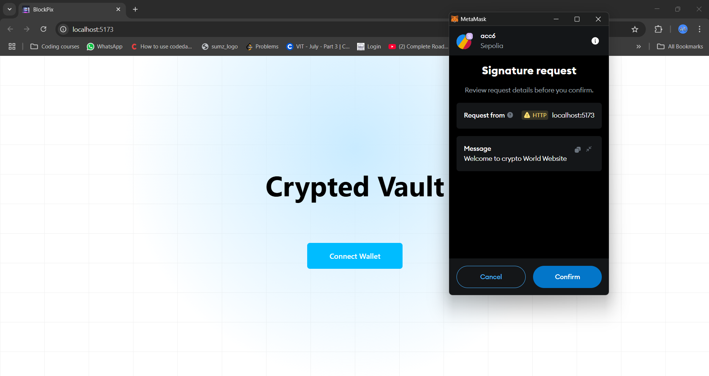

# 📷 BlockPix - Secure Image Vault on Blockchain

BlockPix is a decentralized image vault that leverages **Blockchain Technology** and **IPFS (via Pinata Cloud)** to provide secure, immutable, and censorship-resistant storage for your images.

## 🚀 Features

- 🔐 **Blockchain Security** – Image metadata is stored on the blockchain, ensuring immutability.
- 🌍 **Decentralized Storage** – Images are stored on **IPFS via Pinata**, preventing data loss.
- 🖼️ **Tamper-Proof** – Image hashes are securely stored, preventing unauthorized modifications.
- 🔎 **Easy Retrieval** – Retrieve images quickly using their unique IPFS hash.
- 📜 **Smart Contracts** – Ethereum-based contracts handle image ownership and verification.

## 🛠️ Tech Stack

- **Frontend:** React.js
- **Backend:** Node.js, Express
- **Blockchain:** Ethereum, Solidity, Web3.js
- **Storage:** IPFS (Pinata Cloud)
- **Database:** MongoDB (for user authentication & metadata)

## 📌 How It Works

1. **Upload Image** → Image is stored on **IPFS via Pinata**.
2. **Generate Hash** → The IPFS hash is recorded on the **Ethereum blockchain**.
3. **Verify & Retrieve** → Users can access images securely using their **hash & smart contract data**.

## 🔧 Installation & Setup

1. **Clone the Repository**
   ```sh
   git clone https://github.com/yourusername/blockpix.git
   cd blockpix
   ```
2. **Install Dependencies**
   ```sh
   npm install
   ```
3. **Setup Environment Variables**
   - Create a `.env` file in the root directory
   - Add the following values:
     ```env
     INFURA_API_KEY=your_infura_api_key
     PINATA_API_KEY=your_pinata_api_key
     PINATA_SECRET_API_KEY=your_pinata_secret_api_key
     MONGO_URI=your_mongodb_uri
     ```
4. **Start the Development Server**
   ```sh
   cd client
   npm run dev

   cd server
   npm start
   ```
5. **Deploy Smart Contracts** (Ensure you have Hardhat or Truffle installed)
   ```sh
   npx hardhat run scripts/deploy.js --network sepolia
   ```

## 🚀 Live Demo

- **First Page Of the Website**


- **Connecting To Wallet**



## 🤝 Contributing

We welcome contributions! Feel free to fork, raise issues, and submit PRs.

## 📜 License

This project is licensed under the MIT License.

---
Made with ❤️ by BlockPix Team
